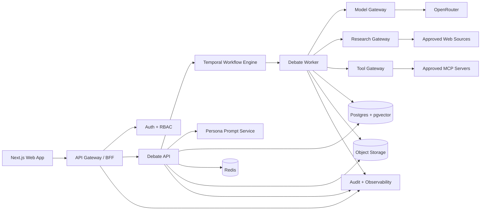

# 2026 Architecture and Tech Stack

## 1) Simplification Strategy
The 2025 implementation attempted too much at once. The 2026 architecture should enforce:
- One model access layer: OpenRouter only.
- One orchestration runtime with durable workflows.
- One typed API contract shared by frontend and backend.
- One stable V1 decision workflow before advanced modules.

## 2) Recommended Stack (2026)
### Frontend and BFF
- **Next.js 16 + React 19 + TypeScript**.
- App Router + Server Actions for backend-for-frontend tasks.
- Tailwind + shadcn components, customized with Arinar dark-matte tokens.

### Orchestration/API
- **FastAPI (Python, Pydantic v2)** for debate orchestration and document services.
- **Temporal** workflows for deterministic turn/state progression and retries.
- Realtime transport using **SSE for model token streaming** + **Redis pub/sub for room fan-out**.
- Optional WebSocket control channel for advanced collaborative controls only.
- Future-ready modality layer for text/voice/hybrid sessions.

### Data and Storage
- **Postgres 16 + pgvector** (single source of truth + retrieval).
- S3-compatible object storage for uploaded documents.
- Redis for ephemeral state, rate limits, and realtime fan-out.

### Auth and Enterprise Controls
- Enterprise IdP via WorkOS/Auth0/Okta integration (SAML/OIDC).
- RBAC with org/workspace roles.
- Audit-log pipeline for every admin/model action.
- Policy engine for internet research permissions and participant/tool controls.

### Observability and Reliability
- OpenTelemetry traces across UI/API/worker.
- Sentry for error monitoring.
- Metrics dashboards for latency, token cost, and queue health.

## 3) OpenRouter BYOK Architecture (required)
### Key handling model
1. User enters OpenRouter key in settings.
2. Backend validates key with OpenRouter.
3. Key is envelope-encrypted (KMS) and stored per workspace/user policy.
4. Workers decrypt key only in-memory for live requests.
5. Logs/telemetry always redact key and prompt-sensitive secrets.

### Runtime model
- All model calls go through a single `ModelGateway` service.
- Gateway adds OpenRouter auth header at runtime.
- Provider/model routing stays configurable, but OpenRouter remains sole external endpoint.
- Optional per-org policy: allowed model list, max spend/day, blocked domains.

### Research model (internet verification)
- Agent internet access is disabled by default.
- Enabled access is mediated by a `ResearchGateway` service (no direct model browsing).
- Gateway enforces domain allowlists, request/token/time budgets, and approval mode.
- All research requests/results are source-linked and audit logged.

### Tool/MCP model (future)
- Agent tool calling is gateway-mediated and disabled by default.
- Tool calls execute through `ToolGateway` and approved MCP adapters.
- Policy checks enforce tool permissions, risk classes, budgets, and approval mode.
- Tool inputs/outputs are stored with provenance and audit logs.

## 4) Reference Architecture

## 5) Canonical Service Boundaries
- `debate-service`: room lifecycle, participants, turn policy, outcomes.
- `document-service`: ingest, chunking, embeddings, citation anchors.
- `persona-service`: persona templates, AI persona generation, prompt compilation/validation.
- `model-gateway`: OpenRouter calls, policy checks, metering, retries.
- `research-gateway`: policy-controlled internet verification with citation outputs.
- `tool-gateway`: controlled tool execution and MCP server mediation.
- `identity-service`: org/workspace membership, RBAC, SSO claims.
- `billing-metering-service`: token and cost accounting per org/workspace.

## 6) Launch-Ready Non-Functionals
- P95 API latency and queue SLAs.
- Idempotent debate turn processing.
- Sub-second host arbitration path for pre-turn nudge decisions.
- Deterministic transcript normalization for voice sessions.
- Regional failover strategy (active-passive acceptable for V1).
- Tenant-scoped data access tests in CI.
- Disaster recovery backups for Postgres and object storage.

## 7) Why this is simpler than current repo
- Removes provider-specific branching in core orchestration.
- Replaces ad hoc state handling with durable workflows.
- Enforces one API contract and one auth model.
- Keeps advanced systems optional after V1 stabilization.
- Adds controlled internet verification without exposing unrestricted browsing.

## 8) 2026 Research Inputs (Primary Sources)
- Next.js documentation and versioning: https://nextjs.org/docs
- React 19 release notes: https://react.dev/blog/2024/12/05/react-19
- FastAPI documentation: https://fastapi.tiangolo.com/
- Temporal Python SDK docs: https://docs.temporal.io/develop/python
- OpenRouter API documentation: https://openrouter.ai/docs/api-reference/overview
- OpenRouter key management docs: https://openrouter.ai/docs/api-reference/authentication
- pgvector project docs: https://github.com/pgvector/pgvector
