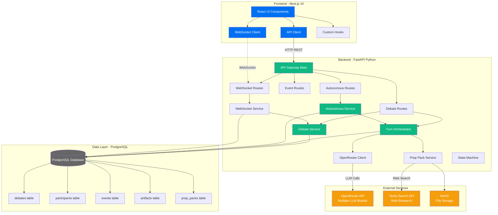
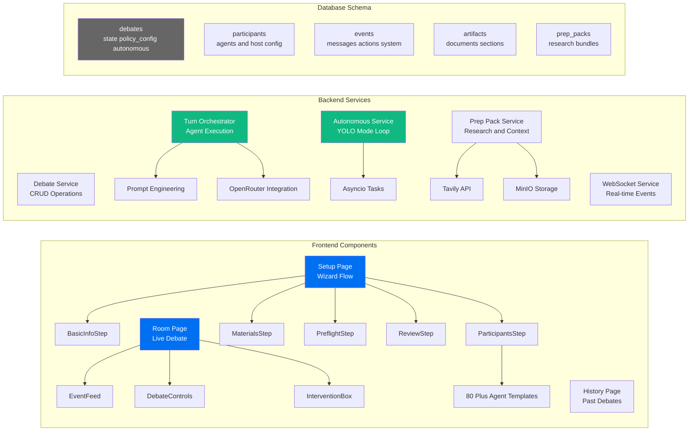
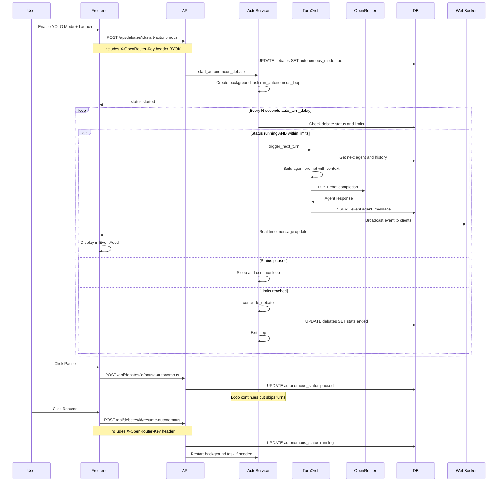
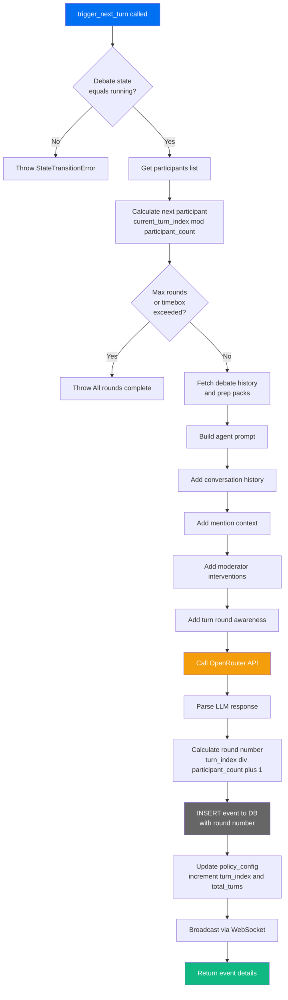
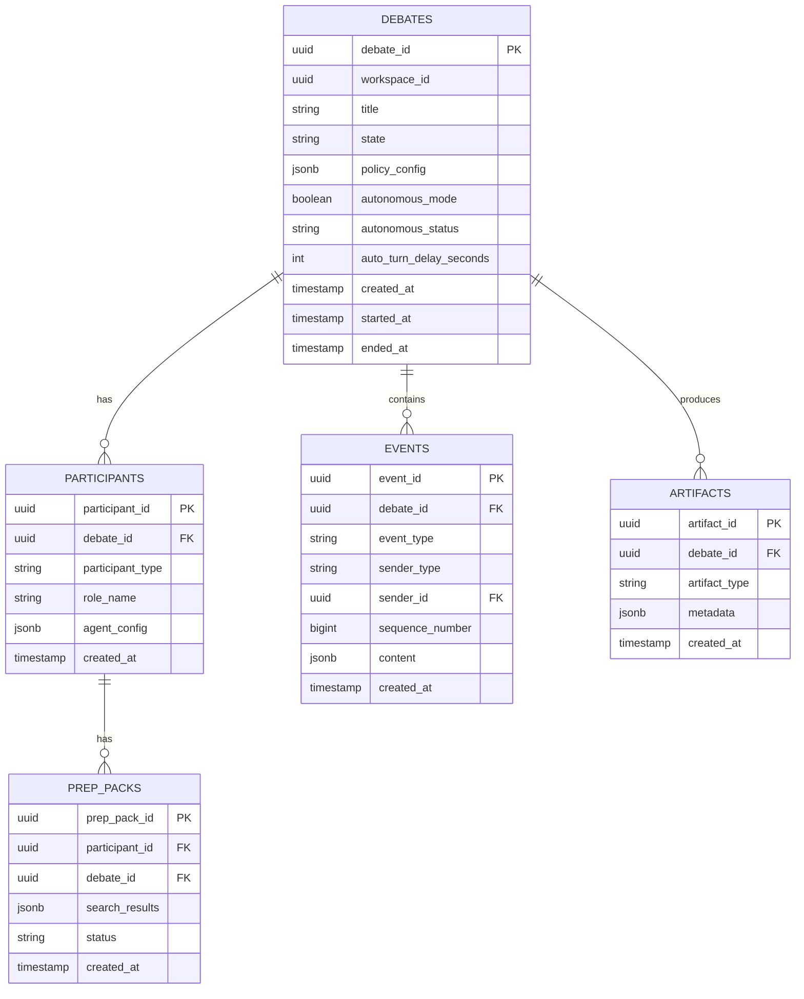
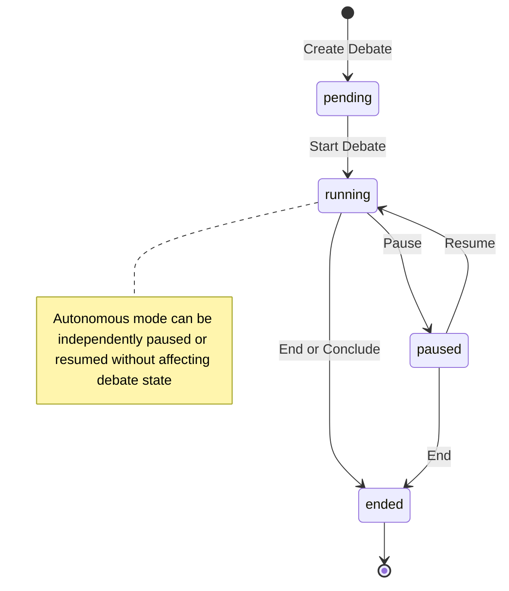
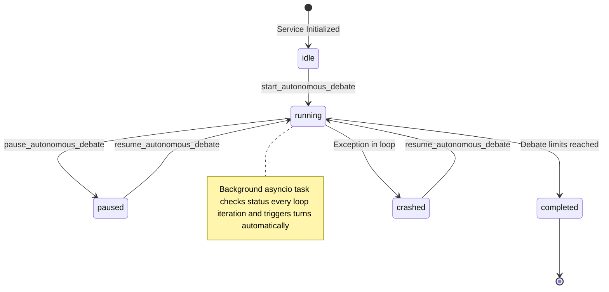

# Arinar System Architecture

## High-Level System Overview



---

## Detailed Component Architecture



---

## Data Flow: Autonomous (YOLO) Mode



---

## Turn Orchestration Flow



---

## Database Schema



---

## Key Technologies

| Layer | Technology | Purpose |
|-------|-----------|---------|
| **Frontend** | Next.js 15 (React) | Server-side rendering, routing, UI components |
| **State Management** | React Hooks (useState, useEffect, custom hooks) | Client-side state, WebSocket management |
| **Styling** | CSS Modules | Scoped styles, Vercel OLED dark theme |
| **Real-time** | WebSocket (native) | Live event streaming, bi-directional communication |
| **API Layer** | FastAPI (Python) | REST API, WebSocket server, async operations |
| **LLM Integration** | OpenRouter API | Multi-model support (GPT-4, Claude, etc.) |
| **Web Research** | Tavily API | Real-time web search for agent context |
| **Database** | PostgreSQL 15+ | Relational data, JSONB for flexible schemas |
| **File Storage** | MinIO (S3-compatible) | Artifact and document storage |
| **Background Tasks** | Python asyncio | Autonomous debate loops, async operations |
| **Authentication** | JWT tokens | Workspace-based access control |

---

## System Features

### 1. **Debate Setup Wizard**
- 6-step guided setup flow
- 80+ pre-configured agent personas across 15+ categories
- Iconic voices (Elon Musk, Steve Jobs, Jeff Bezos, etc.)
- Medical specialists, legal professionals, tech experts
- Custom agent creation with inline editing
- Prep pack generation with web research (Tavily)
- Host configuration (Ultimate Host as neutral moderator)
- Policy configuration (max rounds, timebox, YOLO mode)

### 2. **Live Debate Room**
- Real-time event feed with WebSocket
- Turn-based orchestration (round-robin)
- Progress tracking (per-agent turn counts, round numbers)
- Intervention system (moderator can inject guidance)
- Autonomous (YOLO) mode with background loop
- Unified pause/resume controls
- Turn separators showing round progression
- @mention support for agent tagging

### 3. **Agent Intelligence**
- Multi-model support via OpenRouter
- Persona-specific system prompts
- Context-aware prompts with full debate history
- Web research integration (prep packs)
- Temperature and token customization per agent
- First principles thinking, strategic analysis, domain expertise

### 4. **Autonomous Debates (YOLO Mode)**
- Background asyncio task loop
- Auto-triggers agents every N seconds (configurable)
- Respects max_rounds and timebox limits
- Pause/resume capability
- Crash recovery and status tracking
- BYOK model (Bring Your Own OpenRouter Key)

### 5. **Event System**
- Sequential event numbering
- Event types: agent_message, system_message, human_message, intervention, state_update, presence_update
- WebSocket broadcasting to all connected clients
- Historical event replay (since sequence number)
- Persistent storage in PostgreSQL

---

## File Structure

```
arinar-v2/
├── apps/
│   ├── web/ (Next.js Frontend)
│   │   └── src/
│   │       ├── app/
│   │       │   ├── setup/          # Setup wizard
│   │       │   ├── room/           # Live debate room
│   │       │   └── history/        # Past debates
│   │       ├── components/
│   │       │   ├── setup/          # Setup step components
│   │       │   ├── room/           # Room components (EventFeed, Controls)
│   │       │   └── layout/         # AppNav, UserMenu
│   │       ├── hooks/              # Custom React hooks
│   │       ├── lib/
│   │       │   ├── api.ts          # API client
│   │       │   └── wsClient.ts     # WebSocket client
│   │       └── styles/             # Global styles
│   │
│   └── api/ (FastAPI Backend)
│       └── src/
│           ├── main.py                        # FastAPI app entry
│           ├── routes/
│           │   ├── debates.py                 # Debate CRUD
│           │   ├── autonomous.py              # YOLO mode endpoints
│           │   ├── events.py                  # Event streaming
│           │   ├── websocket.py               # WebSocket endpoint
│           │   └── artifacts.py               # Artifact management
│           ├── debate_service.py              # Debate business logic
│           ├── turn_orchestrator.py           # Turn execution & prompting
│           ├── autonomous_debate_service.py   # Autonomous loop
│           ├── websocket_service.py           # WebSocket manager
│           ├── openrouter_client.py           # LLM integration
│           ├── agent_templates.py             # 80+ agent personas
│           ├── state_machine.py               # Debate state transitions
│           ├── database.py                    # DB connection pool
│           └── tasks/
│               ├── preflight.py               # Prep pack generation
│               └── web_search.py              # Tavily integration
│
├── migrations/                     # SQL migrations
│   ├── 001_initial_schema.sql
│   ├── 007_autonomous_debates.sql
│   └── ...
│
└── docker-compose.yml              # PostgreSQL + MinIO services
```

---

## Key Flows

### Setup → Launch Flow
1. User fills Basic Info (title, problem statement, agenda, outcomes, limits)
2. User selects participants from 80+ templates or existing agents
3. User optionally enables Ultimate Host as moderator
4. User optionally enables YOLO mode (autonomous)
5. System generates prep packs (web research) for each agent
6. System runs preflight checks
7. User reviews configuration
8. User clicks Launch → Creates debate + participants in DB
9. If YOLO enabled: Starts autonomous background loop
10. Redirect to Room page

### Agent Turn Flow
1. TurnOrchestrator determines next agent (round-robin based on turn_index)
2. Fetches debate history, prep packs, interventions
3. Builds context-rich prompt with:
   - Agent's system prompt (persona)
   - Problem statement & desired outcomes
   - Full conversation history
   - @mention context (agents who already spoke)
   - Moderator interventions (if any)
   - Turn/round awareness
4. Calls OpenRouter API with agent's model
5. Parses LLM response
6. Calculates round number: `(turn_index // participant_count) + 1`
7. Persists event to DB with round number
8. Updates policy_config (increment turn_index, total_turns)
9. Broadcasts event via WebSocket
10. Frontend displays message in EventFeed

### WebSocket Event Broadcasting
1. Client connects to `/ws/debates/{debate_id}?token=JWT&since=0`
2. Server validates JWT and workspace access
3. Server sends historical events (since sequence number)
4. Client subscribes to real-time events
5. When events occur (agent messages, state changes):
   - Server creates event envelope
   - Broadcasts to all connected clients for that debate
   - Clients update UI reactively

---

## State Machine



---

## Autonomous Service States



---

## Security & Authentication

- **JWT-based authentication** for all API endpoints
- **Workspace-based access control** (multi-tenancy ready)
- **CORS configured** for cross-origin frontend-backend communication
- **Bring Your Own Key (BYOK)** model for OpenRouter API
  - API key sent via `X-OpenRouter-Key` header
  - Never stored server-side (privacy & security)
- **WebSocket authentication** via query parameter token

---

## Scalability Considerations

1. **Database**: PostgreSQL with JSONB for flexible schemas
   - Indexed on debate_id, sequence_number for fast queries
   - Connection pooling via psycopg2
   
2. **WebSocket**: In-memory connection manager
   - Currently single-instance (future: Redis pub/sub for multi-instance)
   
3. **Background Tasks**: Python asyncio
   - Multiple debates can run autonomously in parallel
   - Each debate = separate background task
   
4. **LLM Calls**: Async/await throughout
   - Non-blocking I/O for OpenRouter API calls
   - Rate limiting handled by OpenRouter
   
5. **File Storage**: MinIO (S3-compatible)
   - Scalable object storage for artifacts
   - Can be replaced with AWS S3, GCS, etc.

---

## Future Enhancements

- [ ] **Telegram Integration**: Stream debates to Telegram, mobile control
- [ ] **Redis pub/sub**: Multi-instance WebSocket support
- [ ] **Observability**: Structured logging, metrics, tracing
- [ ] **Agent memory**: Persistent memory across debates
- [ ] **Coalition support**: Private messaging between agents
- [ ] **Advanced interventions**: Clarifying questions from agents to host
- [ ] **Voice synthesis**: Text-to-speech for agent messages
- [ ] **Export formats**: PDF reports, audio podcasts

---

*Generated: Feb 2026 | Arinar v2 - Multi-Agent Debate Platform*
