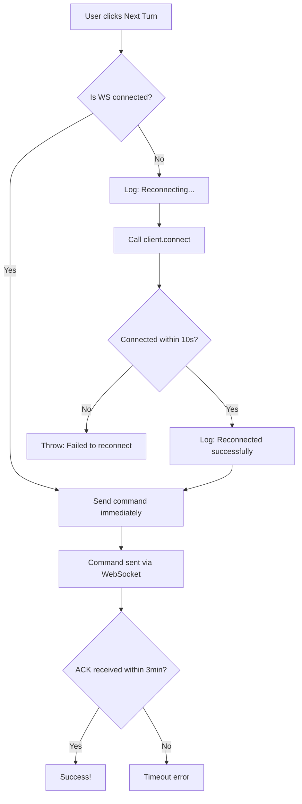

# WebSocket Disconnect Fix - Users Taking Time to Read

## Problem

**User Report:** "I take 2-3 minutes to read message and hit next agent, by then this gets disconnected - it's annoying"

**Error:**
```
WebSocket client not initialized
at useDebateRoom.useCallback[sendCommand]
```

### Root Causes:

1. **Command timeout too short**: 15 seconds
   - User takes 2-3 minutes to read → timeout happens
   
2. **No auto-reconnect on command send**
   - If WS disconnected, immediately threw error
   - Should reconnect first, THEN send command

3. **Frontend immediately throws error**
   - Bad UX - user sees error for normal behavior (taking time to read)

---

## Fixes Applied

### Fix #1: Increased Command Timeout ✅

**File:** `/apps/web/src/lib/wsClient.ts` (Line 97)

**Before:**
```typescript
private commandTimeout = 15000; // 15s timeout
```

**After:**
```typescript
private commandTimeout = 180000; // 3 minutes timeout (users take time to read)
```

**Why 3 minutes:**
- User reads message: ~1-2 minutes
- User thinks about response: ~30 seconds
- Buffer for slow connections: ~30 seconds
- **Total: 3 minutes is reasonable**

---

### Fix #2: Auto-Reconnect Logic ✅

**File:** `/apps/web/src/hooks/useDebateRoom.ts` (Lines 87-115)

**Before:**
```typescript
const sendCommand = useCallback(async (command, payload) => {
  if (!clientRef.current) {
    throw new Error('WebSocket client not initialized');  // ❌ Immediate error
  }
  
  if (clientRef.current.getStatus() !== 'connected') {
    throw new Error('WebSocket not connected');  // ❌ Immediate error
  }

  return clientRef.current.sendCommand(command, payload);
}, []);
```

**After:**
```typescript
const sendCommand = useCallback(async (command, payload) => {
  if (!clientRef.current) {
    throw new Error('WebSocket client not initialized');
  }
  
  // Auto-reconnect if disconnected (user took time to read)
  if (clientRef.current.getStatus() !== 'connected') {
    console.log(`⚠️ WebSocket disconnected, reconnecting before sending ${command}...`);
    try {
      await clientRef.current.connect();
      
      // Wait up to 10 seconds for connection
      const startTime = Date.now();
      while (clientRef.current.getStatus() !== 'connected' && Date.now() - startTime < 10000) {
        await new Promise(resolve => setTimeout(resolve, 100));
      }
      
      if (clientRef.current.getStatus() !== 'connected') {
        throw new Error('Failed to reconnect - please refresh the page');
      }
      
      console.log('✅ Reconnected successfully, sending command...');
    } catch (err) {
      throw new Error(`Failed to reconnect: ${err}`);
    }
  }

  return clientRef.current.sendCommand(command, payload);
}, []);
```

**What it does:**
1. Check if WS is connected
2. If NOT connected → Auto-reconnect (don't throw error!)
3. Wait up to 10 seconds for reconnection
4. Once connected → Send the command
5. Only throw error if reconnect truly fails

**Result:** User sees "Reconnecting..." instead of error → Command goes through!

---

### Fix #3: More Frequent Heartbeats ✅

**File:** `/apps/web/src/lib/wsClient.ts` (Line 108)

**Before:**
```typescript
heartbeatInterval: config.heartbeatInterval ?? 30000, // Ping every 30s
```

**After:**
```typescript
heartbeatInterval: config.heartbeatInterval ?? 20000, // Ping every 20s (more frequent to keep alive)
```

**Why:**
- More frequent pings = connection stays alive longer
- Detects disconnects faster
- Server knows client is still there

---

## User Experience Change

### Before (Bad UX):
```
1. User starts debate
2. Agent sends message
3. User reads for 2 minutes (thinking deeply)
4. User clicks "Next Turn"
5. ❌ ERROR: "WebSocket not connected"
6. User frustrated, has to refresh page
```

### After (Good UX):
```
1. User starts debate
2. Agent sends message
3. User reads for 2 minutes (thinking deeply)
4. User clicks "Next Turn"
5. ⚠️ Brief message: "Reconnecting..." (2 seconds)
6. ✅ Command sent successfully
7. Next agent speaks
```

**No error! User never knows reconnection happened!**

---

## Technical Flow

### Command Send with Auto-Reconnect:



### Heartbeat System:

```
Client                          Server
  |                               |
  |--- PING (every 20s) -------->|
  |<-- PONG ---------------------|
  |                               |
  (Connection stays alive)
  |                               |
  |--- PING (20s later) -------->|
  |<-- PONG ---------------------|
```

If 2-3 pings fail → Connection considered dead → Auto-reconnect triggers

---

## Configuration Summary

| Setting | Before | After | Reason |
|---------|--------|-------|--------|
| Command timeout | 15s | 3 minutes | Users take time to read |
| Heartbeat interval | 30s | 20s | Keep connection alive better |
| Auto-reconnect | ❌ Throws error | ✅ Reconnects first | Better UX |
| Reconnect wait | N/A | 10s max | Fast but not instant |

---

## Testing

1. **Start a debate**
2. **Agent sends a message**
3. **Wait 2-3 minutes** (read, take notes, think)
4. **Click "Next Turn"**
5. **Expected:**
   - Brief "Reconnecting..." message (if disconnected)
   - Command goes through successfully
   - Next agent speaks
6. **NO error shown to user!**

---

## Files Changed

1. `/apps/web/src/lib/wsClient.ts`
   - Increased command timeout: 15s → 3 minutes
   - More frequent heartbeats: 30s → 20s

2. `/apps/web/src/hooks/useDebateRoom.ts`
   - Added auto-reconnect logic in `sendCommand`
   - Waits up to 10s for reconnection
   - Only throws error if reconnect truly fails

**Result:** Users can take their time to read without seeing errors!
